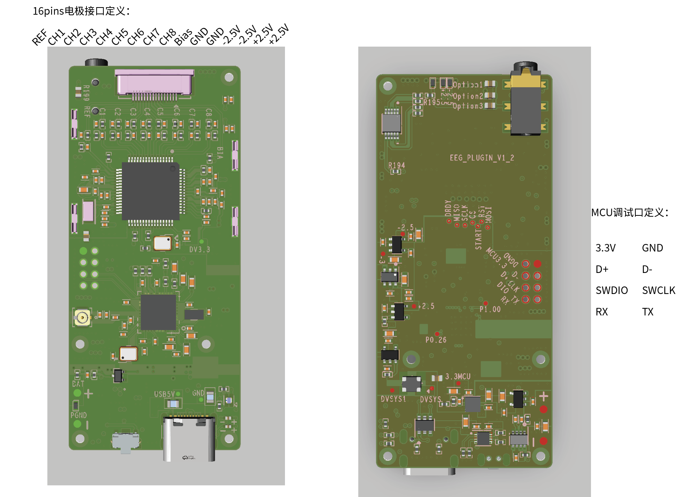

# NeuraDock EEG Workstation Hardware Interface

This repository provides hardware interface and port specifications for third-party integration with **NeuraDock EEG Workstation**.

NeuraDock EEG Workstation is a 7-channel dry-electrode EEG development kit for researchers, developers, and makers working with brain signals.

## Repository Scope

This repository is intended to document interface-level information for developers who want to integrate NeuraDock EEG data or hardware ports with their own software, experiments, applications, or interactive systems.

This repository may include:

- Electrode connector pinout
- Hardware interface notes
- MCU debug interface notes
- Port and connector reference diagrams
- Integration notes for third-party developers

This repository does **not** include:

- Full hardware schematics
- PCB design files
- PCB layout files
- Gerber files
- BOM
- Pick-and-place files
- Manufacturing files
- Internal production test procedures
- Internal manufacturing documentation

NeuraDock is not currently publishing a full open-hardware manufacturing package.

## Public Hardware Boundary

For hardware, the current public release scope focuses on:

```text
Hardware interface and port specifications for third-party integration
```

This means the public materials are intended to support developers who want to connect NeuraDock hardware interfaces or EEG data workflows with their own tools.

It does not mean that the full hardware design is open-sourced for manufacturing, cloning, or PCB-level modification.

## Available Interface Reference

The current hardware interface reference includes:

- 16-pin electrode connector definition
- MCU debug interface definition

See:

- [Interface Pinout](./interface-pinout.md)

## 16-Pin Electrode Connector

Based on the current interface reference diagram, the 16-pin electrode connector is defined as:

| Pin Label | Description |
|---|---|
| REF | Reference electrode input |
| CH1 | EEG channel 1 |
| CH2 | EEG channel 2 |
| CH3 | EEG channel 3 |
| CH4 | EEG channel 4 |
| CH5 | EEG channel 5 |
| CH6 | EEG channel 6 |
| CH7 | EEG channel 7 |
| CH8 | EEG channel 8 (not used) |
| Bias | Bias / driven reference interface |
| GND | Ground |
| GND | Ground |
| -2.5V | Negative analog supply reference |
| -2.5V | Negative analog supply reference |
| +2.5V | Positive analog supply reference |
| +2.5V | Positive analog supply reference |

The public NeuraDock EEG Workstation default 7-channel electrode layout is:

```text
O1, O2, Oz, PO3, PO4, CP5, CP6
```

The relationship between physical channel labels and default electrode placement should be confirmed in the official integration documentation before public release.

## MCU Debug Interface

Based on the current interface reference diagram, the MCU debug interface includes:

| Pin Label | Description |
|---|---|
| 3.3V | 3.3V power reference |
| GND | Ground |
| D+ | USB data positive |
| D- | USB data negative |
| SWDIO | SWD data I/O |
| SWCLK | SWD clock |
| RX | UART receive |
| TX | UART transmit |

These pins are intended for interface reference and development/debugging context. Public usage scope should be confirmed before release.

## Interface Diagram

The current interface diagram can be placed at:

```text
assets/neuradock-hardware-interface-pinout.png
```

Recommended Markdown reference:

```markdown

```

Before public release, the team should confirm whether the uploaded diagram is appropriate for public distribution.

If the full PCB rendering exposes more board-level detail than intended, a simplified pinout-only diagram should be used instead.

## Developer Notes

When using this interface information, developers should:

- Confirm the latest hardware revision before integration.
- Verify pin definitions against the official release documentation.
- Avoid assuming undocumented electrical characteristics.
- Avoid using debug interfaces without confirmation from the NeuraDock team.
- Confirm voltage levels, signal direction, and safe connection methods before connecting external hardware.

## Related Documentation

| Document | Description |
|---|---|
| [Getting Started](https://github.com/Neuradock/eeg-workstation-docs/blob/main/getting-started.md) | First-time setup guide for NeuraDock EEG Workstation |
| [Hardware Interface](https://github.com/Neuradock/eeg-workstation-docs/blob/main/hardware-interface.md) | Hardware interface and port specifications for third-party integration |
| [Data Format](https://github.com/Neuradock/eeg-workstation-docs/blob/main/data-format.md) | EEG text file structure, channel layout, USB data format, and Bluetooth data format |
| [Software Installation](https://github.com/Neuradock/eeg-workstation-docs/blob/main/software-installation.md) | Software environment setup and installation guide |

## Related Repositories

| Repository | Description |
|---|---|
| [eeg-workstation](https://github.com/Neuradock/eeg-workstation) | Main project overview and repository navigation |
| [eeg-workstation-docs](https://github.com/Neuradock/eeg-workstation-docs) | Documentation, setup guides, data format notes, tutorials, and hardware interface notes |
| [eeg-workstation-software](https://github.com/Neuradock/eeg-workstation-software) | NeuraDock Recording Software releases and software usage notes |
| [eeg-workstation-python](https://github.com/Neuradock/eeg-workstation-python) | Python tools, notebooks, and EEG data reading examples |
| [eeg-workstation-examples](https://github.com/Neuradock/eeg-workstation-examples) | Example EEG demos and signal processing workflows |
| [eeg-workstation-sample-data](https://github.com/Neuradock/eeg-workstation-sample-data) | Public sample EEG datasets for tutorials and examples |
| [eeg-workstation-agent](https://github.com/Neuradock/eeg-workstation-agent) | EEG Agent workflows, prompts, and analysis pipelines |

## Links

- Website: [neuradock.com](https://neuradock.com)
- Crowd Supply: [NeuraDock EEG Workstation](https://www.crowdsupply.com/neuradock/neuradock-eeg-workstation)
- YouTube: [@NeuraDock](https://www.youtube.com/@NeuraDock)
- Discord: NeuraDock Community

## License

- Hardware design files: CERN-OHL-W
- Mechanical CAD files: CC BY-SA 4.0
- Software (SDK and tools): MIT License
